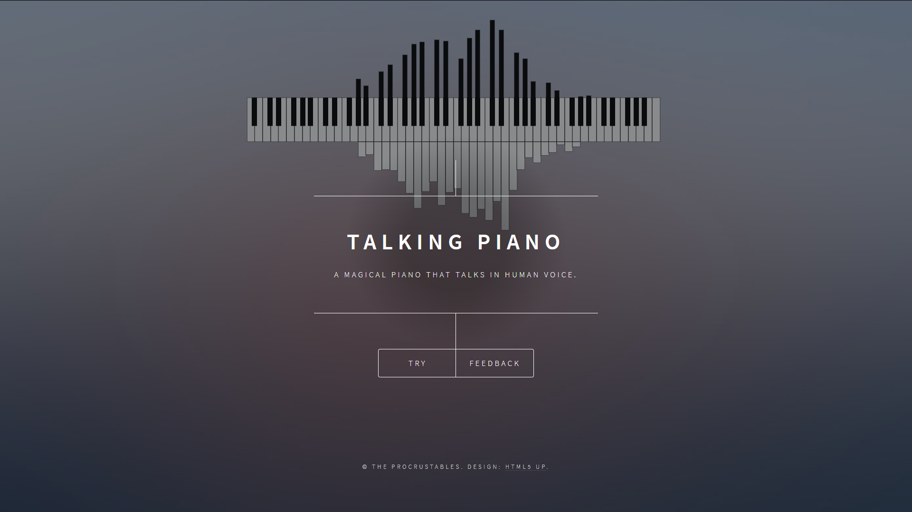
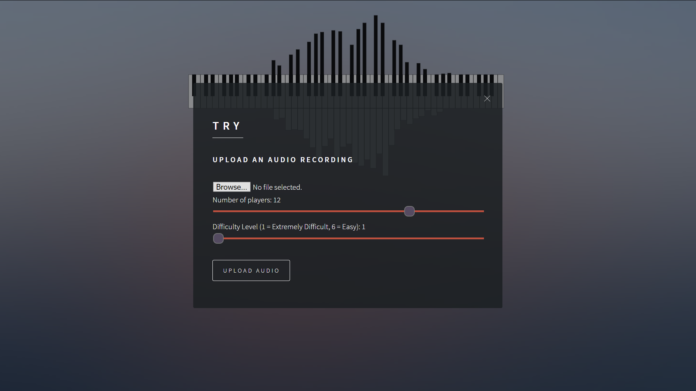
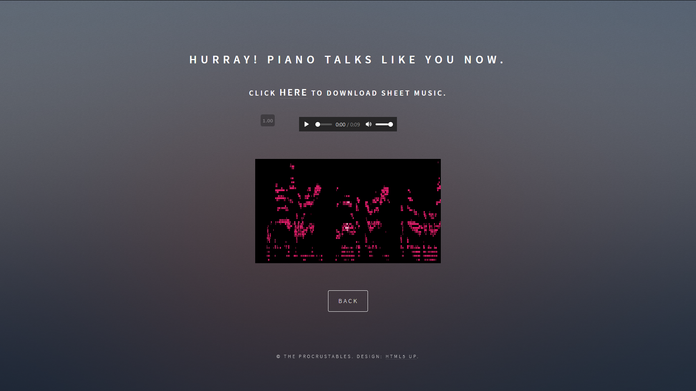

# Talking Piano

Convert your voice into piano sheet music and audio! From a wav file, we will generate mp3 audio, pdf sheet music, and a cool piano roll visualization.

This is a hack we submitted for HopHacks 2020 and won 3rd place! For more details, see [here](https://devpost.com/software/talking-piano-b2mrfa).
 
# Web App

# Usage

We developed a web interface where you can upload an audio file (wav) and it will convert it into piano sheet music.

To get started, clone the repo, pip install the requirements file, then start the webapp with

    python src/webapp.py

To run our code programatically, you can do

    import process_audio
    process_audio.wav2midi("input.wav", "output.mid", {'n_peaks': 12, 'keydiff_threshold': 1})
    
    import musescore_call
    musescore_call.generate_pdf("output.mid", "output.pdf")
    musescore_call.generate_mp3("output.mid", "output.mp3")
    
    import visualize
    visualize.visualize("output.mid", "output.mp4")

# Feedback

Feel free to let us know if you have any questions or suggestions!